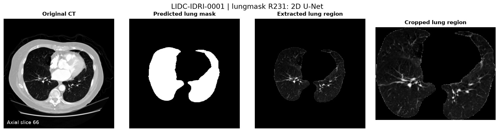
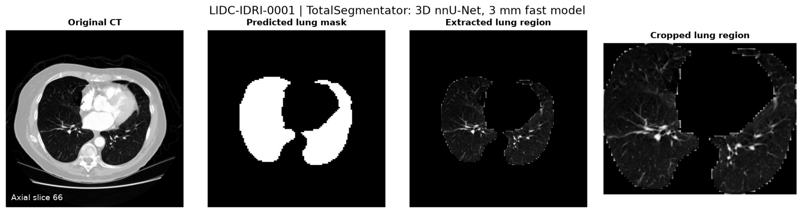

# LIDC-IDRI: automatic whole-lung masks and lung-region images

**Middle-10 sampling:** [folder inventory and batch workflow](MIDDLE10.md).

The current dataset is **LIDC-IDRI**, obtained as original DICOM images through
[NCI Imaging Data Commons](https://portal.imaging.datacommons.cancer.gov/collections/lidc_idri/).
The executed example is **LIDC-IDRI-0001**, one complete **512 × 512 × 133** CT
with **0.703125 × 0.703125 × 2.5 mm** spacing. This is one case, not a run over all
1,010 subjects. The download script accepts other LIDC-IDRI patient and series IDs.

Two pretrained automatic models produce independent whole-lung masks:

- **lungmask R231 (2D U-Net)**, followed by its official volume postprocessing.
- **TotalSegmentator (3D nnU-Net)**, using the 3 mm fast model and the union of
  its five lung-lobe labels.

There is no training, fine-tuning, manual prompting, or use of nodule outlines
during prediction. These are established models, not the newest architectures.

## Actual output previews





Both previews show the prespecified middle axial slice, index 66 (zero-based).
Every axial slice is exported, including empty-lung slices. Crops are created
only for nonempty predictions. See [the run summary](results/lidc_idri_0001/summary.json)
for measured image counts and predicted lung volumes, and each model's
`metrics.json` for input/output hashes, timing, versions, and runtime settings.

**Dice/IoU accuracy is not reported for this case.** The standard LIDC-IDRI
radiologist annotations describe lung nodules, not complete lung fields. No
independent whole-lung reference mask was supplied for this run. Predicted masks
must not be treated as ground truth. The earlier CoronaCases Dice/IoU values in
the project apply only to that earlier dataset. Agreement between two model
outputs would also not establish anatomical accuracy.

## Reproduce

Run from the repository root after the environment setup in [README.md](README.md).
For the result ZIP, run from its root (it includes the `automatic_ct` directory).

```bash
# Download just this complete CT series; public data, no cloud account needed.
python automatic_ct/lidc.py --patient LIDC-IDRI-0001 --output data/lidc_0001

python automatic_ct/run.py --ct data/lidc_0001/ct.nii.gz \
  --case LIDC-IDRI-0001 --model unet --output outputs/lidc_0001/unet

python automatic_ct/run.py --ct data/lidc_0001/ct.nii.gz \
  --case LIDC-IDRI-0001 --model nnunet --single-process \
  --output outputs/lidc_0001/nnunet

for model in unet nnunet; do
  python automatic_ct/preview.py --ct data/lidc_0001/ct.nii.gz \
    --results outputs/lidc_0001/$model --output outputs/lidc_0001/$model
  python automatic_ct/verify_exports.py --ct data/lidc_0001/ct.nii.gz \
    --results outputs/lidc_0001/$model
done
```

Change `--patient` to process another subject. If multiple CT series are found,
the downloader lists their UIDs and requires an explicit `--series UID`; it does
not silently choose or combine scans. Use a separate data/output directory for
each case. Full-cohort training and evaluation require a patient-level split
and independently reviewed whole-lung reference labels.

## Data handling and validation

- The downloader verifies the expected number of DICOM instances, patient and
  series IDs, CT modality, unique SOP instances, slice positions, and consistent
  orientation/spacing. GDCM sorts by physical position and applies the DICOM
  rescale slope/intercept to retain Hounsfield units.
- NIfTI masks retain the CT voxel grid and affine. Their labels are binary.
- PNG lung-region images retain the CT pixels inside the predicted mask and set
  other pixels to black, using the declared [-1000, 400] HU display window.
  Crops use the combined-lung bounding box without resizing.
- `verify_exports.py` checks every exported mask/region/crop against the source
  CT and predicted volume, including coordinates and file counts. These are
  export-integrity checks, not clinical segmentation accuracy checks.
- CPU inference uses six threads. `--single-process` uses the documented
  sequential nnU-Net I/O and FP32 window-accumulation adapter for this runtime.
- The result ZIP contains both volume masks and all mask/region/crop PNGs.
  Original DICOM images and model checkpoints are downloaded by the commands
  above and are not included in the ZIP or committed to GitHub.

## Attribution

- Armato et al. (2015), *Data from LIDC-IDRI*, The Cancer Imaging Archive.
  DOI: [10.7937/K9/TCIA.2015.LO9QL9SX](https://doi.org/10.7937/K9/TCIA.2015.LO9QL9SX).
  Data license: [CC BY 3.0](https://creativecommons.org/licenses/by/3.0/).
  The masks and extracted display images here are derived model outputs.
- Armato et al. (2011), *The Lung Image Database Consortium (LIDC) and Image
  Database Resource Initiative (IDRI): A completed reference database of lung
  nodules on CT scans*. DOI: [10.1118/1.3528204](https://doi.org/10.1118/1.3528204).
- Fedorov et al. (2023), *National Cancer Institute Imaging Data Commons*.
  DOI: [10.1148/rg.230180](https://doi.org/10.1148/rg.230180).
- Model sources: [lungmask](https://github.com/JoHof/lungmask) and
  [TotalSegmentator](https://github.com/wasserth/TotalSegmentator).

One-case research demonstration; model-development overlap has not been audited.
These outputs are not a validated diagnostic product.
