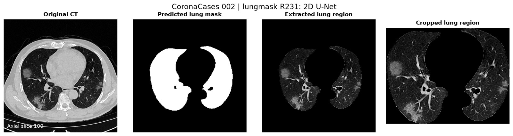
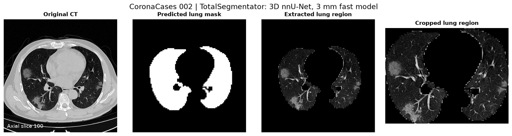

# Actual CT → deep-learning lung masks → lung-region images

This addition runs **pretrained automatic deep-learning models** on a real CT volume.
Neither model receives manual prompts or reference masks during prediction.

## Measured results

Executed on **CoronaCases 002**, a complete 512 × 512 × 200 CT volume:

| Model | Full-volume Dice | Full-volume IoU | Full-frame lung images | Nonempty cropped views |
|---|---:|---:|---:|---:|
| lungmask R231, 2D U-Net | 0.982384 | 0.965378 | 200 | 178 |
| TotalSegmentator, 3D nnU-Net, 3 mm | 0.972706 | 0.946862 | 200 | 176 |

These are actual predictions evaluated against the dataset's reference lung masks,
not synthetic images, training metrics, or scores quoted from a paper. This is
**one patient**, so these numbers do not establish general model superiority or
clinical accuracy. No training or fine-tuning was performed. Overlap with model
development data has not been audited. These are established automatic models,
not a claim to be the two newest segmentation algorithms.

The source is the [original annotated CT dataset](https://zenodo.org/records/3757476),
also available as [Kaggle COVID-19 CT scans](https://www.kaggle.com/datasets/andrewmvd/covid19-ct-scans).
The selected scan is `COVID-19-CT-Seg_20cases.zip/coronacases_002.nii.gz`;
the reference is `Lung_Mask.zip/coronacases_002.nii.gz`. Reference labels 1 and 2
are combined into one whole-lung foreground. Reference masks are read only for
evaluation after the predictions have been saved.

### U-Net result: original CT, binary mask, lung-only image, cropped lungs



### nnU-Net result



The preview uses axial slice 100, the prespecified middle scan slice. The complete
run exports all 200 slices, including empty-lung slices. Crops are omitted for
empty masks; full-frame images and masks are still written for every slice.

## Run it

Use a separate Python 3.12 environment. The executed runtime used CPU PyTorch
2.14.0+cpu and torchvision 0.29.0+cpu; complete model/version information is in
each `results/*/metrics.json`.

```bash
python -m venv .venv-automatic
source .venv-automatic/bin/activate
pip install torch==2.14.0+cpu torchvision==0.29.0+cpu --index-url https://download.pytorch.org/whl/cpu
pip install -r automatic_ct/requirements.txt

# Fetch only this patient's entries from the original public archives.
python automatic_ct/download.py --output example_data

# First model: automatic 2-D U-Net lung segmentation.
python automatic_ct/run.py --ct example_data/ct.nii.gz \
  --case coronacases_002 --model unet \
  --reference example_data/reference.nii.gz --output outputs/automatic/unet

# Second model: automatic 3-D nnU-Net lung-lobe predictions united into lungs.
python automatic_ct/run.py --ct example_data/ct.nii.gz \
  --case coronacases_002 --model nnunet --single-process \
  --reference example_data/reference.nii.gz --output outputs/automatic/nnunet

python automatic_ct/preview.py --ct example_data/ct.nii.gz \
  --results outputs/automatic/unet --output outputs/automatic/unet
```

Omit `--reference` to process your own unlabeled CT scans. The model still creates
the masks and lung-region images; accuracy scores require an independent reference.
Provide a NIfTI volume with CT intensities in Hounsfield units. Arbitrary JPEGs or
already-windowed CT screenshots are not supported by this volumetric workflow.

## Output files

| Output | Meaning |
|---|---|
| `lung_mask.nii.gz` | Full-volume binary lung mask in the original CT voxel grid |
| `masks_png/slice_NNN.png` | Predicted binary mask for every axial slice |
| `lung_regions/slice_NNN.png` | **Lung region image:** CT pixels retained inside the predicted mask, black outside |
| `lung_regions_cropped/slice_NNN.png` | The same masked image cropped to the combined lung bounding box |
| `slice_index.csv` | Slice indices, mask areas, and crop coordinates |
| `metrics.json` | Actual scores, hashes, versions, run settings, and exported image counts |
| `lung_region_preview.png` | Original CT / mask / extracted region / crop comparison |
| `three_slice_preview.png` | The same comparison at 25%, 50%, and 75% scan depth |

PNG images use a **fixed [-1000, 400] HU display window**, converted to 8-bit grayscale.
They are display images, not quantitative HU volumes. The pixel values inside the
predicted mask are preserved from that windowed CT image; outside pixels are set to
zero. Cropped views retain original pixel size and do not resize the lungs.
Full-volume NIfTI masks preserve the original spatial geometry. Axial PNGs are
canonical RAS slices displayed radiologically (anterior up, patient's right on left).

## Implementation and validation

- U-Net uses the official `lungmask.LMInferer`, R231 checkpoint, batch size 2, and
  the package's volume postprocessing.
- nnU-Net uses official TotalSegmentator `total`, `fast=True` (3 mm) with the five
  lung lobes selected, then combines those labels into a binary mask.
- Both were executed on CPU with six PyTorch threads.
- This restricted runtime cannot use the multiprocessing manager socket. The
  optional `--single-process` adapter calls nnU-Net's official sequential predictor.
  It also uses **FP32 Gaussian window accumulation** because the upstream mixed-FP16
  CPU kernel failed CPU-info initialization. Model weights, patch locations,
  Gaussian weighting, and preprocessing/resampling remain the upstream methods.
  This compatibility path is recorded in the nnU-Net run metadata.
- Output geometry and reference geometry are checked before evaluation.
- Exported lung-only images and crops were checked against the CT pixels and
  predicted masks. No reference mask was used to generate the extracted images.
- No pseudo-label scores or phantom results are included in the table above.

Raw CT data, model checkpoints, and the complete image exports are not committed
to this repository. The chat result ZIP supplies the generated masks and lung
images; the commands above reproduce them from the public source.

## Sources

- [lungmask code and trained model](https://github.com/JoHof/lungmask)
- [U-Net R231 paper](https://doi.org/10.1186/s41747-020-00173-2)
- [TotalSegmentator code and trained models](https://github.com/wasserth/TotalSegmentator)
- [TotalSegmentator paper](https://arxiv.org/abs/2208.05868)
- [Annotated CT dataset](https://zenodo.org/records/3757476)

These outputs are for research and inspection, not a validated diagnostic product.
